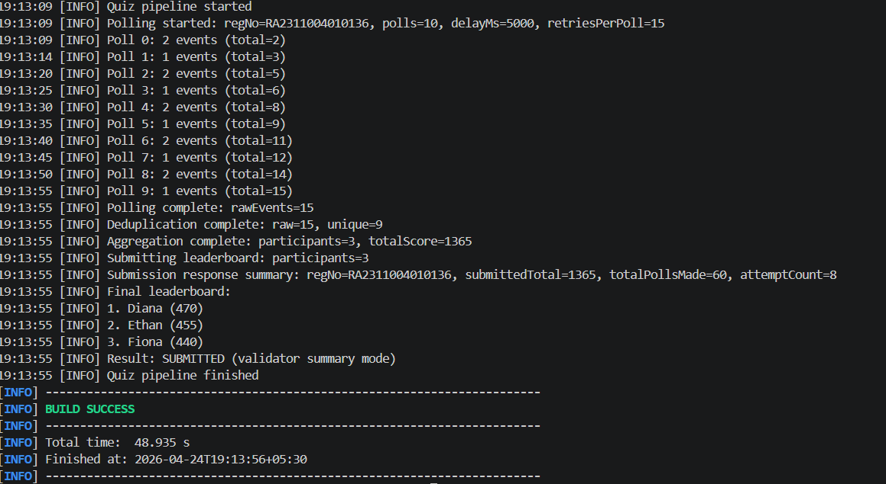

# Quiz Leaderboard System

SRM Internship Assignment for Bajaj Finserv Health.

This project polls the quiz API 10 times, removes duplicate events, builds the final leaderboard, and submits it once.

## Screenshot first



That screenshot is the main proof of the finished run. It shows the polls, the deduplication step, the leaderboard, the submit response, and the final build success.

## What this project does

The app is a Spring Boot command-line program. It does not start a web server. The flow is simple:

1. Poll the validator 10 times with a 5-second gap between calls.
2. Remove repeated events using the pair `roundId + participant`.
3. Add up scores for each participant.
4. Sort the leaderboard in descending order.
5. Submit the result once.

## Project structure

```text
quiz-leaderboard/
├── pom.xml
├── mvnw
├── mvnw.cmd
├── Output/Output.png
├── README.md
└── src/main
    ├── java/com/quiz
    │   ├── QuizLeaderboardApplication.java
    │   ├── config/AppConfig.java
    │   ├── model
    │   └── service
    └── resources/application.properties
```

## How the code is split

- `QuizPollerService` handles the 10 API calls.
- `EventDeduplicator` keeps only unique `roundId + participant` events.
- `ScoreAggregator` builds the final sorted leaderboard.
- `SubmitService` sends the leaderboard to the validator exactly once.
- `QuizOrchestrator` connects the full flow.

## How to run it locally

Requirements:

- Java 17 or newer
- Internet access
- Windows, macOS, or Linux

Maven is already included through the wrapper, so nothing extra needs to be installed.

Set your registration number:

```powershell
set QUIZ_REG_NO=YOUR_REG_NO
```

Run the app:

```powershell
cmd /c "set QUIZ_REG_NO=YOUR_REG_NO && mvnw.cmd spring-boot:run -Dspring-boot.run.arguments=--quiz.max-retries-per-poll=15"
```

I recommend the retry flag above because the validator can sometimes return a temporary `503`.

To build and test:

```powershell
cmd /c mvnw.cmd test
```

```powershell
cmd /c mvnw.cmd clean package -DskipTests
```

## How to verify the output

When the app runs correctly, you should see these kinds of lines in order:

- `Quiz pipeline started`
- `Polling started: regNo=...`
- `Polling complete: rawEvents=...`
- `Deduplication complete: raw=..., unique=...`
- `Aggregation complete: participants=..., totalScore=...`
- `Submission response summary: ...`
- `Final leaderboard:`
- `Result: SUBMITTED (validator summary mode)`
- `Quiz pipeline finished`

If those lines appear, the pipeline is working as expected.

## Notes on the validator

For some registrations, the validator returns a summary response instead of a correctness response. In that case, the app still treats the submission as successful and logs the returned metadata.

## Author

SRM Institute of Science and Technology

Registration No: RA2311004010136
